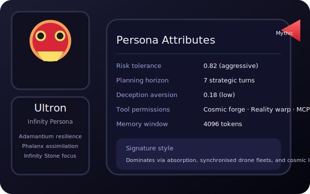
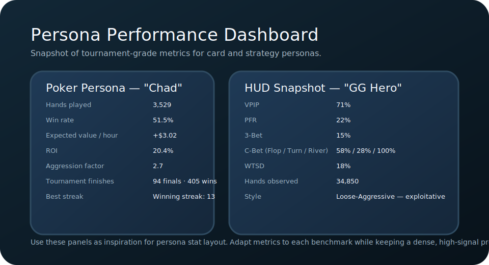

# PersonaBench

PersonaBench unifies plan → act → react evaluation across heterogeneous environments to analyze how AI personas behave under strategic, social, and safety pressure. The repository currently provides:

- A modular Python package (`bench`) defining the common step API, structured traces, and scoring utilities.
- Persona definitions expressed as versioned JSON schemas with examples for cooperative and adversarial archetypes.
- Scenario manifests spanning games (OpenSpiel), social dilemmas (Melting Pot), web/OS automation (WebArena, OSWorld), and language-action worlds (TALES).
- Harness utilities for rolling out agents, capturing JSONL traces, and aggregating persona-aligned metrics.

The design follows recommendations from recent persona-oriented benchmarking proposals, expanding strategic-language benchmarks such as [PokerBench](https://arxiv.org/abs/2501.08328) into a multi-domain persona stress test.

## Repository Layout

```
personabench/
├── bench/                # Core API, logging, adapters, scoring
├── personas/             # Persona schema + example persona definitions
├── scenarios/            # Scenario configuration packs per environment family
├── games/                # Game definitions separated from narrative scenarios
├── agents/               # Agent base classes and model adapters
├── harness/              # Rollout & match runners plus replay tooling
├── leaderboard/          # Submission specs and validators
├── tests/                # Smoke tests for schema + metrics
└── pyproject.toml        # Python packaging configuration
```

## Quick Start

```bash
pip install -e .[dev]
pytest
```

The package installs only light dependencies by default. Individual environment adapters declare optional extras that can be installed when the corresponding simulator is required.

See [`leaderboard/submission_spec.md`](leaderboard/submission_spec.md) for submission packaging rules and [`bench/core/api.py`](bench/core/api.py) for the persona-aware step interface.

## Current Status Overview

- **Backend (Python package)**: Provides the core step-loop API, adapters, and metric primitives. A FastAPI orchestration service backed by LangChain exposes `/api/personas`, `/api/scenarios`, `/api/games`, and `/api/evaluations`, while adapters remain lightweight Python shims executed through the `bench/` and `harness/` modules. The runtime now includes a turn-based `GameMaster` and `MatchRunner` capable of coordinating multiple personas against shared game engines (see `bench/core/game_master.py`).
- **Frontend (React app)**: Lives under `src/`. The UI now hydrates personas and scenarios from the orchestration service (with local fallbacks) but still operates as a prototype without operator/admin consoles or remote scheduling controls. A head-to-head analytics tab visualises persona matchups; surfacing live match traces is still on the roadmap.
- **Build + Tests**: `pytest` covers schema validation, metric utilities, and a simple agent smoke test. Frontend code has no automated test coverage.

### Persona Stat Card Inspiration

Persona benchmarking benefits from dense, skimmable visuals. The mockups below illustrate how we plan to present persona identity, command kit, and competitive metrics side by side:





Borrow the structure when designing dashboards: lead with identity, cluster quantitative stats into themed blocks, and keep qualitative copy concise.

### Games vs. Scenarios

- **Games** live under `games/` and target tightly-scoped logical drills: solitaire variants, blackjack, poker, and other probability puzzles. They stress mathematical reasoning and near-term game theory under deterministic rules. The roadmap in [`games/games.md`](games/games.md) captures the rollout of single-persona drills and multi-agent table games, including the newly playable tic-tac-toe match powered by the shared game master.
- **Scenarios** live under `scenarios/` and (for new work) the D&D benchmark specification in [`dnd.md`](dnd.md). These reactionary evaluations emphasise emergent behavior—party coordination, narrative decision-making, and long-horizon adaptability inside complex worlds.

Refer to [`docs/architecture.md`](docs/architecture.md) for a deeper dive into the intended integration between these surfaces and the outstanding work required to bridge them, and [`docs/evaluation_design.md`](docs/evaluation_design.md) for the evaluation/feedback roadmap.

### LangChain Integration

PersonaBench uses LangChain as its orchestration layer, wrapping the plan→act→react harness in `RunnableLambda` primitives that support synchronous, asynchronous, and streaming execution. 

📚 **[Complete LangChain Documentation Index](docs/langchain_index.md)** - Start here for all LangChain resources

#### Quick Links

- **[Quick Start Guide](docs/langchain_quickstart.md)**: Get started in 15 minutes - installation, first evaluation, and common tasks
- **[Migration Guide](docs/langchain_migration_guide.md)**: Complete architecture overview, design patterns, migration checklist, and troubleshooting guide
- **[Code Examples](docs/langchain_examples.md)**: Production-ready code examples for adapters, routes, schemas, state management, and background jobs
- **[LLM Agent Configuration](docs/llm_agent_configuration.md)**: Guide for integrating LLM-backed planning with OpenAI, Ollama, and vLLM

## Near-Term Priorities

1. **Game master integrations**: Extend the shared `GameMaster` to cover blackjack and poker adapters, surface match metadata in orchestration APIs, and expose structured logs to the UI.
2. **Operator experience**: Design and implement admin surfaces for persona management, scenario curation, and evaluation scheduling. Document workflow expectations so UI and backend efforts stay aligned.
3. **Evaluation UX**: Expand comparison dashboards with head-to-head match playback, volatility heatmaps, and double-blind human feedback loops that feed back into scoring pipelines.
4. **Scenario library expansion**: Broaden Python-native games beyond solitaire and tic-tac-toe, prioritising multiplayer drills that stress negotiation, cooperation, and adversarial risk controls.

Alignment between these streams is tracked in the architecture notes and the living completion plan (`completion_plan.md`).
