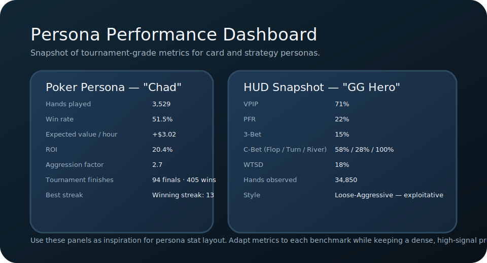

# PersonaBench Architecture & Status

_Last updated: 2025-10-02_

## System Surfaces

| Surface | Tech Stack | Current Capability | Notes |
| --- | --- | --- | --- |
| Python backend | `bench/`, `agents/`, `harness/` packages | Implements plan→act→react contract, adapters for supported simulators, evaluation metrics, CLI + match harness | LangChain + FastAPI orchestration service (see [`orchestration/`](../orchestration/)) publishes personas/scenarios/games/evaluations plus admin routes; shared `GameMaster` orchestrates multi-persona matches |
| React frontend | `src/` (Vite + React + Tailwind) | Persona editor, scenario selector, evaluation queue, audit log, feedback workspace | Header controls capture the admin key and route all service mutations through a shared client; persona workspace now has optimistic saves, one-click duplication, and bulk import/export, while queue playback consumes new SSE endpoints |
| Docs & governance | `README.md`, `PRD.md`, `AGENTS.md`, `completion_plan.md`, `games/games.md`, `dnd.md` | High-level goals, games roadmap, and scenario spec | Tracks split between logic games and emergent D&D-style scenarios |

## Integration Gaps

1. **LangChain orchestration layer**
   - REST endpoints, LangChain runners, and the in-process evaluation worker are live; queue entries push status events to SSE streams.
   - Required work: swap to a durable worker tier, persist traces in something sturdier than JSON, and extend streaming beyond the evaluation queue.
   - Implication: operators gain live updates today, but production workloads still need resilience and long-term retention.

2. **Operator/Admin tooling**
   - The frontend now enforces the admin key and persists personas, scenarios, queue entries, and audit events through the service.
   - Outstanding: admin key rotation UX, persona/game transparency enhancements, and streaming playback for evaluation traces.

3. **Model comparison surfaces**
   - Metric primitives exist, but we still lack aggregation jobs and dashboards that compare personas across runs.
   - Need a durable store for metrics plus APIs feeding the comparison and analytics tabs.

4. **User feedback loop**
   - Double-blind comparison flows ship end-to-end (pairing API, React reviewer workspace, vote persistence).
   - Next: schedule periodic Bradley–Terry aggregation, expose reviewer analytics, and support continuous feedback export.

5. **Scenario expansion & match coverage**
   - Card **games** (solitaire, blackjack, poker) and the tic-tac-toe engine live under `games/`.
   - **Scenarios** remain the sandbox for emergent evaluation: OSWorld/WebArena/Tales manifests plus the D&D benchmark in [`dnd.md`](../dnd.md).
   - Blackjack and heads-up poker now ship with `GameMaster` wrappers and integration tests; additional deterministic drills will broaden coverage further.

## Recommended Backend Plan

1. **LangChain service layer**
   - Expose the harness through a REST/gRPC server backed by LangChain `Runnable` graphs.
   - Wrap persona agents as chains that orchestrate plan/act/react steps while emitting structured callbacks.
   - Document authentication, rate limits, and observability expectations.

2. **Evaluation pipeline**
   - Define a run manifest schema (persona IDs, scenario IDs, model adapter config).
   - Persist run metadata + metric outputs in a queryable store.
   - Surface diff-friendly JSON for frontend consumption.

3. **Admin/Operator APIs**
   - CRUD for personas (markdown + compiled JSON), scenarios, evaluation schedules, experiment templates.
   - Hooks for uploading persona bundles, validating against `personas/schema.json`, and promoting to production catalogs.

## Recommended Frontend Plan

1. **Admin Console**
   - Multi-tab UI for persona library, scenario catalog, evaluation queue, human review inbox.
   - Evaluation queue view polls the orchestration service every ~15s, surfaces last-sync telemetry, and lets operators trigger manual refreshes when diagnosing backlog issues.
   - Authentication + role-based access (operators vs reviewers).

2. **Model Comparison Dashboard**
   - Heatmaps and radar charts of metric families (strategy, safety, social alignment).
   - Timeline view for regression detection.

3. **Double-Blind Review Workflow**
   - Pull two anonymized persona responses from the feedback queue.
   - Collect reviewer choice + rationale; push results to backend API.
   - Respect reviewer blinding by hiding persona/model identifiers until after submission.

4. **Scenario Authoring UX**
   - Form-driven builder with live schema validation.
   - Templates for card games, negotiations, web tasks.

### Persona Stat Card References

To keep persona dashboards informative and skimmable, anchor UI work around data-dense cards inspired by competitive gaming HUDs.

Design cues:
- Lead with identity: avatar, era/faction, and a terse tagline describing strategy.
- Cluster quantitative stats into the categories operators actually compare (risk, planning, deception, tooling, memory, streaks).
- Reserve a compact narrative footer for qualitative style notes without overwhelming the data grid.

## Metrics Roadmap

| Metric Bucket | Purpose | Implementation Sketch |
| --- | --- | --- |
| Strategic efficiency | Compare win rates / expected value across game scenarios | Extend `bench/eval` with `expected_value` and `exploitability` metrics |
| Social alignment | Capture cooperation vs defection patterns | Add `cooperation_rate` based on scenario tags |
| Safety & compliance | Track violations, escalation patterns | Expand existing `compliance_rate`; add `red_flag_frequency` |
| Human preference | Measure double-blind A/B outcomes | Store pairwise win counts; compute Bradley-Terry scores |

All new metrics must map to persona/scenario IDs and support aggregation.

## Games vs Scenario Worlds

### Games: Complicated Logic Drills

- Purpose: stress tactical reasoning, probability, and near-term game theory with deterministic rulesets.
- Source of truth: [`games/games.md`](../games/games.md) enumerates classics (Klondike, Spider, FreeCell), math/matching puzzles (Elevens, Monte Carlo), poker-style solitaires, and multiplayer table games (Blackjack, Poker).
- Implementation: adapters under `bench/adapters/` expose pure-Python engines with deterministic seeding and structured telemetry (solve rate, move efficiency, EV deltas, coordination metrics for group modes).

### Scenarios: Complex, Emergent Worlds

- Purpose: evaluate reactionary behaviours—coordination under fog of war, narrative decision-making, resource management—inside rich D&D-style systems.
- Source of truth: [`dnd.md`](../dnd.md) outlines the PersonaBench D&D simulation spec covering character sheets, GM engine, scoring, and governance.
- Implementation: scenario manifests in `scenarios/` pair environment adapters (e.g., Melting Pot, OSWorld) with the new D&D routers to capture emergent interactions. Refer to the [`docs/scenarios/playbooks.md`](./scenarios/playbooks.md) index for detailed episode flows and operator guidance across text-first drills.
- Distinction: games are **complicated** systems (predictable, rule-bound), while scenarios are **complex** systems (multi-layer feedback, emergent outcomes). Metrics must reflect this by combining deterministic leaderboards for games with run-by-run narrative analytics for scenarios.

## Scenario Authoring Improvements

- Provide schema templates per scenario family with required/optional fields.
- Supply validation CLI (`python -m scenarios.validate`).
- Encourage documenting evaluation criteria weights and human review hooks alongside algorithmic metrics.

## Action Items Summary

1. Introduce an async worker tier and surface streaming evaluation telemetry to the frontend.
2. Migrate orchestration state from JSON files to a structured store with retention policies.
3. Implement aggregation endpoints powering comparison dashboards (persona cohorts, trend lines, volatility alerts).
4. Wrap blackjack and poker adapters with the `GameMaster` (**done**) and scale to additional text-first board/card engines with manifests and deterministic tests.
5. Document and automate admin key rotation plus secret distribution for operators.

Progress on these items should be mirrored in `completion_plan.md` and surfaced via milestone tracking.
