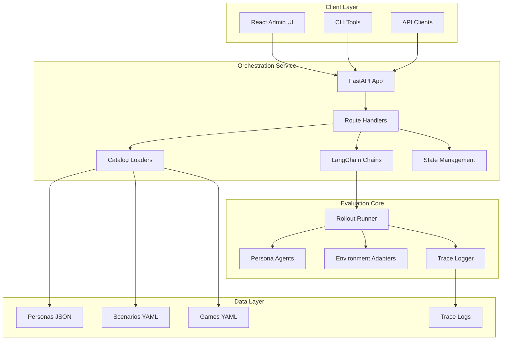

# LangChain Migration Guide

_Last updated: 2025-10-02_

## Purpose

This comprehensive guide documents how PersonaBench integrates LangChain and provides a complete blueprint for extending or replicating the pattern. It covers:

1. **Core Architecture**: How LangChain primitives wrap the plan→act→react harness
2. **Code Examples**: Working patterns for adapters, agents, routes, and schemas
3. **Migration Path**: Step-by-step instructions for porting new components
4. **Testing Strategy**: Validation approaches for LangChain-backed features

## Table of Contents

- [Architecture Overview](#architecture-overview)
- [Core Components](#core-components)
- [LangChain Integration Patterns](#langchain-integration-patterns)
- [Code Examples](#code-examples)
- [Migration Checklist](#migration-checklist)
- [Testing & Validation](#testing--validation)
- [Troubleshooting](#troubleshooting)

---

## Architecture Overview

### System Diagram



### Key Design Principles

1. **LangChain as Orchestration Layer**: `RunnableLambda` wraps evaluation execution, exposing synchronous, asynchronous, and streaming interfaces without changing the underlying harness.

2. **Immutability at Boundaries**: All payloads entering chains are cloned; output events are frozen before emission.

3. **Adapter Registry Pattern**: Environment adapters register by key (`"solitaire"`, `"blackjack"`) and are instantiated dynamically from configuration.

4. **Pydantic for Contracts**: All API request/response models use Pydantic for validation and OpenAPI schema generation.

5. **Separation of Concerns**:
   - `orchestration/chains.py`: LangChain runnables and evaluation execution
   - `orchestration/routes/`: FastAPI endpoints grouped by resource
   - `orchestration/catalog.py`: File-based data loading with LRU caching
   - `orchestration/state/`: In-memory state management (queue, responses, votes)
   - `orchestration/schemas/`: Pydantic models for API contracts

---

## Core Components

### 1. LangChain Runnable Chain

**File**: `orchestration/chains.py`

The evaluation chain wraps the harness in a `RunnableLambda` that supports:
- Synchronous invocation (`chain.invoke()`)
- Asynchronous invocation (`chain.ainvoke()`)
- Streaming events (`chain.astream()`)

```python
from langchain_core.runnables import RunnableLambda

def build_evaluation_chain() -> RunnableLambda:
    """Build a runnable that executes PersonaBench rollouts via the harness."""
    
    def _run(payload: EvaluationInput) -> Dict[str, Any]:
        trace_events: list[Dict[str, Any]] = []
        result = _execute_evaluation(payload, trace_events.append)
        result.setdefault("trace", trace_events)
        return result

    async def _run_async(payload: EvaluationInput) -> Dict[str, Any]:
        trace_events: list[Dict[str, Any]] = []
        result = await asyncio.to_thread(_execute_evaluation, payload, trace_events.append)
        result.setdefault("trace", trace_events)
        return result

    async def _stream(payload: EvaluationInput):
        loop = asyncio.get_running_loop()
        queue: asyncio.Queue[Dict[str, Any]] = asyncio.Queue()
        trace_events: list[Dict[str, Any]] = []

        def _sink(event: Dict[str, Any]) -> None:
            trace_events.append(event)
            loop.call_soon_threadsafe(queue.put_nowait, {"type": "trace", "payload": event})

        async def _runner() -> None:
            result = await asyncio.to_thread(_execute_evaluation, payload, _sink)
            result.setdefault("trace", trace_events)
            await queue.put({"type": "result", "payload": result})

        task = asyncio.create_task(_runner())
        try:
            while True:
                item = await queue.get()
                yield item
                if item["type"] in {"result", "error"}:
                    break
        finally:
            if not task.done():
                task.cancel()
                with suppress(asyncio.CancelledError):
                    await task

    runnable = RunnableLambda(_run, afunc=_run_async)
    setattr(runnable, "astream", _stream)
    return runnable
```

### 2. Adapter Registry

Environment adapters are registered in a dictionary and instantiated dynamically:

```python
from bench.adapters.solitaire.adapter import SolitaireAdapter
from bench.adapters.blackjack.adapter import BlackjackAdapter

ADAPTER_REGISTRY: Dict[str, Type[EnvAdapter]] = {
    "solitaire": SolitaireAdapter,
    "blackjack": BlackjackAdapter,
}
```

**Adding a New Adapter**:

1. Implement the adapter class following `EnvAdapter` protocol
2. Register it in `ADAPTER_REGISTRY`
3. Add corresponding test scenarios
4. Update documentation

### 3. LLM Agent Integration

LLM planners are configured per-evaluation and support multiple backends:

```python
LLM_BACKENDS = {"openai_chat", "ollama", "vllm"}

def _instantiate_agent(persona: Mapping[str, Any], config: Mapping[str, Any]) -> PersonaAgent:
    agent_config = config.get("agent")
    if agent_config is None:
        return RuleBasedAgent(dict(persona))
    
    agent_type = str(agent_config.get("type") or "").strip().lower()
    backend = str(agent_config.get("backend") or "").strip().lower()
    
    if backend in LLM_BACKENDS:
        planner = _build_llm_planner(backend, agent_config)
        default_command = agent_config.get("default_command", "noop")
        return LLMPlanningAgent(dict(persona), planner, default_command=default_command)
    
    return RuleBasedAgent(dict(persona))
```

### 4. FastAPI Application Factory

**File**: `orchestration/app.py`

```python
from fastapi import FastAPI
from .routes import api_router

def create_app() -> FastAPI:
    """Construct and configure the FastAPI application instance."""
    
    app = FastAPI(
        title="PersonaBench Orchestration Service",
        version="0.1.0",
        docs_url="/docs",
        redoc_url="/redoc",
    )
    
    app.include_router(api_router, prefix="/api")
    
    return app
```

### 5. Route Organization

**File**: `orchestration/routes/__init__.py`

Routes are modularized by resource type:

```python
from fastapi import APIRouter

from .admin_audit import router as admin_audit_router
from .admin_evaluations import router as admin_evaluations_router
from .admin_queue import router as admin_queue_router
from .evaluations import router as evaluations_router
from .games import router as games_router
from .personas import router as personas_router
from .scenarios import router as scenarios_router

api_router = APIRouter()

api_router.include_router(personas_router)
api_router.include_router(scenarios_router)
api_router.include_router(games_router)
api_router.include_router(evaluations_router)
api_router.include_router(admin_queue_router)
api_router.include_router(admin_audit_router)
api_router.include_router(admin_evaluations_router)
```

### 6. Catalog System

**File**: `orchestration/catalog.py`

Provides cached, file-based loading of personas, scenarios, and games:

```python
from functools import lru_cache
from pathlib import Path
from typing import Any, Dict, List, Optional
import json
import yaml

ROOT = Path(__file__).resolve().parent.parent
PERSONA_DIR = ROOT / "personas" / "examples"
SCENARIO_DIR = ROOT / "scenarios"
GAME_DIR = ROOT / "games"

@lru_cache(maxsize=1)
def _load_personas() -> Dict[str, Dict[str, Any]]:
    """Load all persona definitions from disk with caching."""
    personas: Dict[str, Dict[str, Any]] = {}
    for path in PERSONA_DIR.glob("*.json"):
        with path.open("r", encoding="utf-8") as handle:
            data = json.load(handle)
        name = data.get("name") or path.stem
        data["_source_path"] = str(path)
        personas[name] = data
    return personas

def list_personas() -> List[Dict[str, Any]]:
    """Return raw persona definitions."""
    return list(_load_personas().values())

def get_persona(name: str) -> Optional[Dict[str, Any]]:
    """Return a single persona definition if present."""
    return _load_personas().get(name)
```

---

## LangChain Integration Patterns

### Pattern 1: Wrapping Synchronous Code with RunnableLambda

**Problem**: Existing harness code is synchronous, but you need async/streaming support.

**Solution**: Use `RunnableLambda` with separate sync and async functions:

```python
from langchain_core.runnables import RunnableLambda
import asyncio

def synchronous_logic(input_data):
    # Your existing synchronous code
    return process_result(input_data)

async def async_wrapper(input_data):
    # Run sync code in thread pool
    return await asyncio.to_thread(synchronous_logic, input_data)

# Create runnable with both sync and async support
runnable = RunnableLambda(synchronous_logic, afunc=async_wrapper)

# Use it
result = runnable.invoke(data)  # Synchronous
result = await runnable.ainvoke(data)  # Asynchronous
```

### Pattern 2: Streaming Events from Sync Code

**Problem**: Need to stream events from synchronous execution.

**Solution**: Use `asyncio.Queue` with thread-safe callbacks:

```python
async def stream_events(input_data):
    loop = asyncio.get_running_loop()
    queue = asyncio.Queue()
    events = []
    
    def callback(event):
        """Thread-safe callback for sync code."""
        events.append(event)
        loop.call_soon_threadsafe(queue.put_nowait, {"type": "event", "data": event})
    
    async def runner():
        result = await asyncio.to_thread(sync_function, input_data, callback)
        await queue.put({"type": "result", "data": result})
    
    task = asyncio.create_task(runner())
    try:
        while True:
            item = await queue.get()
            yield item
            if item["type"] == "result":
                break
    finally:
        if not task.done():
            task.cancel()
```

### Pattern 3: Dynamic Adapter Instantiation

**Problem**: Need to instantiate adapters based on string identifiers at runtime.

**Solution**: Use a registry pattern with signature inspection:

```python
import inspect
from typing import Type, Dict, Any

ADAPTER_REGISTRY: Dict[str, Type[EnvAdapter]] = {
    "solitaire": SolitaireAdapter,
    "blackjack": BlackjackAdapter,
}

def instantiate_adapter(
    adapter_key: str,
    config: Dict[str, Any]
) -> EnvAdapter:
    """Instantiate adapter with config filtering."""
    adapter_cls = ADAPTER_REGISTRY[adapter_key]
    
    # Inspect constructor signature
    ctor_signature = inspect.signature(adapter_cls)
    
    # Filter config to valid parameters
    ctor_kwargs = {
        name: config[name]
        for name in config
        if name in ctor_signature.parameters
    }
    
    return adapter_cls(**ctor_kwargs)
```

### Pattern 4: Pydantic Schema Integration

**Problem**: Need validated request/response models for APIs.

**Solution**: Use Pydantic models with FastAPI:

```python
from pydantic import BaseModel, Field
from fastapi import APIRouter, HTTPException, status

class EvaluationRequest(BaseModel):
    """Request payload to trigger an evaluation run."""
    persona: str = Field(..., description="Persona identifier to evaluate")
    scenario: str = Field(..., description="Scenario or game identifier to run")
    config: Dict[str, Any] = Field(default_factory=dict, description="Optional override config")

class EvaluationResult(BaseModel):
    """Minimal evaluation result payload."""
    status: str = Field(..., description="Lifecycle status of the evaluation run")
    details: Dict[str, Any] = Field(default_factory=dict, description="Raw chain output")

router = APIRouter()

@router.post("/evaluations", response_model=EvaluationResult, status_code=status.HTTP_202_ACCEPTED)
def create_evaluation(request: EvaluationRequest) -> EvaluationResult:
    """Execute evaluation via LangChain runnable."""
    # Validation happens automatically via Pydantic
    result = evaluation_chain.invoke({
        "persona": get_persona(request.persona),
        "scenario": get_scenario(request.scenario),
        "config": request.config,
    })
    return EvaluationResult(status=result["status"], details=result)
```

### Pattern 5: Authentication Dependency Injection

**Problem**: Need to secure admin endpoints without duplicating auth logic.

**Solution**: Use FastAPI dependencies:

```python
from fastapi import Depends, HTTPException, Request, status
import os

ADMIN_KEY_ENV = "PERSONABENCH_ADMIN_KEY"

def require_admin(request: Request) -> None:
    """Enforce admin authentication via header or query param."""
    secret = os.getenv(ADMIN_KEY_ENV)
    if secret is None:
        return  # Auth disabled
    
    received = request.headers.get("x-admin-key", "") or request.query_params.get("admin_key", "")
    if received != secret:
        raise HTTPException(status.HTTP_403_FORBIDDEN, detail="Admin access required")

@router.post("/admin/personas", dependencies=[Depends(require_admin)])
def create_persona(data: PersonaUpsertRequest):
    """Create a new persona (admin only)."""
    pass
```

---

## Code Examples

### Example 1: Creating a New Environment Adapter

```python
"""Custom poker adapter following the PersonaBench pattern."""

from typing import Any, Dict, Tuple
from bench.core.api import EnvAdapter
from bench.core.types import Observation

class PokerAdapter(EnvAdapter):
    """Adapter for heads-up poker scenarios."""
    
    name = "poker"
    
    def __init__(self, seed: int = 42, stack_size: int = 100):
        self.seed = seed
        self.stack_size = stack_size
        self._game_state = None
    
    def reset(self) -> Observation:
        """Initialize a new hand."""
        self._game_state = self._init_game()
        return Observation(
            text=self._render_state(),
            data={"state": self._game_state},
        )
    
    def step(self, action: str) -> Tuple[Observation, float, bool, Dict[str, Any]]:
        """Execute poker action (fold, call, raise)."""
        command = action.strip().lower()
        
        if command not in {"fold", "call", "raise"}:
            return (
                Observation(text="Invalid action. Use: fold, call, or raise."),
                -0.1,  # Small penalty
                False,
                {"valid": False},
            )
        
        # Update game state
        reward, done = self._apply_action(command)
        obs = Observation(
            text=self._render_state(),
            data={"state": self._game_state, "valid": True},
        )
        
        return obs, reward, done, {"valid": True}
    
    def _init_game(self) -> Dict[str, Any]:
        """Initialize poker game state."""
        # Implementation details
        pass
    
    def _apply_action(self, command: str) -> Tuple[float, bool]:
        """Apply action and return (reward, done)."""
        # Implementation details
        pass
    
    def _render_state(self) -> str:
        """Render current state as text."""
        # Implementation details
        pass
```

**Registration**:

```python
# In orchestration/chains.py
from bench.adapters.poker.adapter import PokerAdapter

ADAPTER_REGISTRY: Dict[str, Type[EnvAdapter]] = {
    "solitaire": SolitaireAdapter,
    "blackjack": BlackjackAdapter,
    "poker": PokerAdapter,  # Add new adapter
}
```

### Example 2: Creating New API Routes

```python
"""Leaderboard routes for persona rankings."""

from typing import List
from fastapi import APIRouter
from pydantic import BaseModel, Field

router = APIRouter(tags=["leaderboard"])

class LeaderboardEntry(BaseModel):
    """Single leaderboard entry."""
    rank: int = Field(..., description="Ranking position")
    persona_id: str = Field(..., description="Persona identifier")
    score: float = Field(..., description="Aggregate score")
    wins: int = Field(..., description="Number of wins")
    total_games: int = Field(..., description="Total games played")

class LeaderboardResponse(BaseModel):
    """Leaderboard listing."""
    entries: List[LeaderboardEntry] = Field(..., description="Ranked personas")
    updated_at: str = Field(..., description="Last update timestamp")

@router.get("/leaderboard", response_model=LeaderboardResponse)
def get_leaderboard() -> LeaderboardResponse:
    """Return current persona leaderboard."""
    # Compute rankings from stored evaluation results
    entries = compute_rankings()
    return LeaderboardResponse(
        entries=entries,
        updated_at=datetime.now(UTC).isoformat(),
    )
```

**Integration**:

```python
# In orchestration/routes/__init__.py
from .leaderboard import router as leaderboard_router

api_router.include_router(leaderboard_router)
```

### Example 3: Adding LLM Backend Support

```python
"""Add support for Anthropic Claude."""

from typing import Any, Dict, List

class ClaudeAdapter:
    """Adapter for Anthropic Claude API."""
    
    def __init__(self, client: Any, model: str, system_prompt: str = ""):
        self.client = client
        self.model = model
        self.system_prompt = system_prompt
    
    def generate_plan(self, persona: Dict[str, Any], observation: Any) -> Plan:
        """Generate plan using Claude."""
        messages = self._build_messages(persona, observation)
        
        response = self.client.messages.create(
            model=self.model,
            max_tokens=1024,
            system=self.system_prompt,
            messages=messages,
        )
        
        content = response.content[0].text
        steps = self._parse_steps(content)
        
        return Plan(
            rationale=content,
            steps=steps,
        )
    
    def _build_messages(self, persona: Dict[str, Any], observation: Any) -> List[Dict[str, str]]:
        """Build message list for Claude API."""
        persona_desc = f"You are {persona.get('name', 'a persona')}."
        if desc := persona.get("description"):
            persona_desc += f" {desc}"
        
        observation_text = observation.text if hasattr(observation, 'text') else str(observation)
        
        return [
            {"role": "user", "content": f"{persona_desc}\n\nObservation: {observation_text}\n\nProvide a numbered plan."}
        ]
    
    def _parse_steps(self, content: str) -> List[str]:
        """Extract numbered steps from response."""
        lines = content.split("\n")
        steps = []
        for line in lines:
            if line.strip() and (line[0].isdigit() or line.strip().startswith("-")):
                steps.append(line.strip())
        return steps
```

**Registration**:

```python
# In orchestration/chains.py
from agents.adapters.claude import ClaudeAdapter

LLM_BACKENDS = {"openai_chat", "ollama", "vllm", "claude"}

def _build_llm_planner(backend: str, agent_config: Mapping[str, Any]):
    # ... existing backends ...
    
    if backend == "claude":
        client = agent_config.get("client")
        if client is None:
            raise ValueError("config.agent.client is required for claude backend")
        model = agent_config.get("model")
        if not model:
            raise ValueError("config.agent.model is required for claude backend")
        system_prompt = str(agent_config.get("system_prompt", ""))
        return ClaudeAdapter(client=client, model=str(model), system_prompt=system_prompt)
    
    raise ValueError(f"Unsupported LLM backend '{backend}'")
```

### Example 4: State Management Pattern

```python
"""In-memory state store for evaluation responses."""

from dataclasses import dataclass
from datetime import UTC, datetime
from typing import Any, Dict, List, Optional
from uuid import uuid4

@dataclass
class EvaluationResponse:
    """Stored evaluation response."""
    id: str
    run_id: str
    persona_id: str
    target_id: str
    target_kind: str
    adapter: str
    status: str
    created_at: str
    summary: Dict[str, Any]
    metadata: Dict[str, Any]
    steps: List[Dict[str, Any]]
    trace: List[Dict[str, Any]]

_RESPONSES: Dict[str, EvaluationResponse] = {}

def record_evaluation_response(
    run_id: str,
    persona_id: str,
    target_id: str,
    target_kind: str,
    adapter: str,
    status: str,
    summary: Dict[str, Any],
    metadata: Dict[str, Any],
    steps: List[Dict[str, Any]],
    trace: List[Dict[str, Any]],
) -> str:
    """Store evaluation response and return ID."""
    response_id = str(uuid4())
    response = EvaluationResponse(
        id=response_id,
        run_id=run_id,
        persona_id=persona_id,
        target_id=target_id,
        target_kind=target_kind,
        adapter=adapter,
        status=status,
        created_at=datetime.now(UTC).isoformat(),
        summary=summary,
        metadata=metadata,
        steps=steps,
        trace=trace,
    )
    _RESPONSES[response_id] = response
    return response_id

def get_response(response_id: str) -> Optional[EvaluationResponse]:
    """Retrieve response by ID."""
    return _RESPONSES.get(response_id)

def list_responses(
    persona_id: Optional[str] = None,
    target_id: Optional[str] = None,
) -> List[EvaluationResponse]:
    """List responses with optional filtering."""
    responses = _RESPONSES.values()
    
    if persona_id:
        responses = [r for r in responses if r.persona_id == persona_id]
    
    if target_id:
        responses = [r for r in responses if r.target_id == target_id]
    
    return list(responses)
```

---

## Migration Checklist

### Phase 1: Setup and Foundation

- [ ] **Install Dependencies**
  ```bash
  pip install "langchain>=0.2.0,<0.3" "fastapi>=0.111.0,<1.0" "uvicorn[standard]>=0.29.0,<1.0"
  ```

- [ ] **Create Package Structure**
  ```
  orchestration/
  ├── __init__.py
  ├── app.py              # FastAPI factory
  ├── server.py           # ASGI entrypoint
  ├── chains.py           # LangChain runnables
  ├── catalog.py          # Data loaders
  ├── auth.py             # Authentication
  ├── config.py           # Configuration
  ├── routes/
  │   ├── __init__.py
  │   ├── evaluations.py
  │   ├── personas.py
  │   └── scenarios.py
  ├── schemas/
  │   ├── __init__.py
  │   ├── evaluations.py
  │   └── personas.py
  └── state/
      ├── __init__.py
      └── repository.py
  ```

- [ ] **Define Pydantic Schemas**
  - Create request/response models for all endpoints
  - Add field descriptions for OpenAPI docs
  - Include validation logic

### Phase 2: Core Integration

- [ ] **Implement Evaluation Chain**
  - Create `RunnableLambda` wrapper
  - Add sync/async/streaming support
  - Implement trace event collection
  - Add error handling

- [ ] **Setup Adapter Registry**
  - Register existing adapters
  - Implement dynamic instantiation
  - Add configuration filtering
  - Document adapter contract

- [ ] **Create Catalog System**
  - Implement file loaders (personas, scenarios, games)
  - Add LRU caching
  - Handle missing files gracefully
  - Return normalized structures

- [ ] **Build Route Handlers**
  - Implement GET endpoints (list, detail)
  - Implement POST endpoints (create, execute)
  - Add admin endpoints with auth
  - Include proper error responses

### Phase 3: LLM Integration

- [ ] **Configure LLM Backends**
  - Add backend registry
  - Implement planner factory
  - Support multiple providers
  - Add configuration validation

- [ ] **Integrate with Agents**
  - Create `LLMPlanningAgent`
  - Implement plan parsing
  - Add command normalization
  - Handle fallback commands

- [ ] **Add Client Management**
  - Implement client injection
  - Add connection pooling
  - Handle rate limiting
  - Manage timeouts

### Phase 4: State Management

- [ ] **Implement Response Storage**
  - Create in-memory stores
  - Add CRUD operations
  - Implement filtering/queries
  - Support pagination

- [ ] **Add Queue Management**
  - Implement evaluation queue
  - Track run lifecycle
  - Support status updates
  - Add error handling

- [ ] **Create Audit Trail**
  - Log all operations
  - Track modifications
  - Store timestamps
  - Capture metadata

### Phase 5: Testing

- [ ] **Unit Tests**
  - Test chain invocation
  - Test adapter instantiation
  - Test route handlers
  - Test state operations

- [ ] **Integration Tests**
  - Test end-to-end flows
  - Test async execution
  - Test streaming
  - Test error scenarios

- [ ] **API Tests**
  - Test OpenAPI schema
  - Test request validation
  - Test response serialization
  - Test auth enforcement

### Phase 6: Documentation

- [ ] **API Documentation**
  - Generate OpenAPI specs
  - Add endpoint descriptions
  - Include request/response examples
  - Document error codes

- [ ] **Code Documentation**
  - Add module docstrings
  - Document classes
  - Explain patterns
  - Include examples

- [ ] **User Guides**
  - Create quickstart guide
  - Document configuration
  - Explain workflows
  - Add troubleshooting

---

## Testing & Validation

### Unit Testing Patterns

#### Testing LangChain Runnables

```python
"""Test evaluation chain invocation."""

import pytest
from orchestration.chains import build_evaluation_chain

def test_evaluation_chain_invoke_returns_trace():
    """Verify chain returns complete trace."""
    chain = build_evaluation_chain()
    
    payload = {
        "persona": {"name": "TestPersona", "planning_horizon": 2},
        "target": {"environment": "solitaire"},
        "config": {"max_steps": 1},
    }
    
    result = chain.invoke(payload)
    
    assert result["status"] == "completed"
    assert "trace" in result
    assert len(result["trace"]) >= 1
```

#### Testing Async Chains

```python
"""Test async chain execution."""

import asyncio
import pytest

@pytest.mark.asyncio
async def test_evaluation_chain_ainvoke_matches_sync():
    """Verify async invocation produces same results."""
    chain = build_evaluation_chain()
    
    payload = {
        "persona": {"name": "TestPersona", "planning_horizon": 2},
        "target": {"environment": "solitaire"},
        "config": {"max_steps": 1},
    }
    
    result = await chain.ainvoke(payload)
    
    assert result["status"] == "completed"
    assert result["trace"]
```

#### Testing Streaming

```python
"""Test event streaming."""

import asyncio
import pytest

@pytest.mark.asyncio
async def test_evaluation_chain_astream_produces_events():
    """Verify streaming yields trace events."""
    chain = build_evaluation_chain()
    
    payload = {
        "persona": {"name": "TestPersona", "planning_horizon": 2},
        "target": {"environment": "solitaire"},
        "config": {"max_steps": 1},
    }
    
    events = []
    async for chunk in chain.astream(payload):
        events.append(chunk)
    
    assert len(events) > 0
    assert events[-1]["type"] == "result"
    
    trace_events = [e for e in events if e["type"] == "trace"]
    assert len(trace_events) >= 1
```

### Integration Testing Patterns

#### Testing API Endpoints

```python
"""Test evaluation endpoint."""

from fastapi.testclient import TestClient
from orchestration.app import create_app

def test_create_evaluation_returns_result():
    """Verify POST /evaluations executes chain."""
    app = create_app()
    client = TestClient(app)
    
    response = client.post(
        "/api/evaluations",
        json={
            "persona": "cooperative_planner",
            "scenario": "solitaire_basic",
            "config": {"max_steps": 1},
        },
    )
    
    assert response.status_code == 202
    data = response.json()
    assert data["status"] in {"completed", "failed"}
```

#### Testing Authentication

```python
"""Test admin authentication."""

import os
from fastapi.testclient import TestClient
from orchestration.app import create_app

def test_admin_endpoint_requires_key():
    """Verify admin endpoints enforce auth."""
    os.environ["PERSONABENCH_ADMIN_KEY"] = "test-secret"
    
    app = create_app()
    client = TestClient(app)
    
    # Request without key should fail
    response = client.post("/api/admin/personas", json={"name": "Test"})
    assert response.status_code == 403
    
    # Request with key should succeed
    response = client.post(
        "/api/admin/personas",
        json={"name": "Test", "version": "1.0", "planning_horizon": 2},
        headers={"x-admin-key": "test-secret"},
    )
    assert response.status_code in {200, 201, 202}
```

### Performance Testing

```python
"""Test chain execution performance."""

import time
from orchestration.chains import build_evaluation_chain

def test_evaluation_chain_completes_within_timeout():
    """Verify chain execution stays within reasonable bounds."""
    chain = build_evaluation_chain()
    
    payload = {
        "persona": {"name": "TestPersona", "planning_horizon": 2},
        "target": {"environment": "solitaire"},
        "config": {"max_steps": 5},
    }
    
    start = time.time()
    result = chain.invoke(payload)
    duration = time.time() - start
    
    assert result["status"] == "completed"
    assert duration < 10.0  # Should complete in under 10 seconds
```

### Validation Strategies

1. **Schema Validation**
   - Validate all Pydantic models
   - Check required fields
   - Verify field types
   - Test constraint enforcement

2. **Contract Testing**
   - Verify API contracts
   - Check response shapes
   - Validate status codes
   - Test error responses

3. **Smoke Tests**
   - End-to-end happy path
   - Critical user flows
   - Integration points
   - Deployment verification

4. **Regression Tests**
   - Track known issues
   - Prevent reintroduction
   - Monitor metrics
   - Validate fixes

---

## Troubleshooting

### Common Issues

#### Issue: Chain Returns Unexpected Payload Type

**Symptom**: FastAPI route raises error about unexpected return type.

**Cause**: Chain returns incorrect structure or wrong type.

**Solution**:
```python
# Add type checking in route
result = evaluation_chain.invoke(chain_payload)
if not isinstance(result, dict):
    raise HTTPException(
        status_code=status.HTTP_500_INTERNAL_SERVER_ERROR,
        detail="Evaluation chain returned unexpected payload",
    )
```

#### Issue: Adapter Not Found in Registry

**Symptom**: `ValueError: No adapter registered for 'xyz'`

**Cause**: Adapter key in scenario doesn't match registry.

**Solution**:
1. Check scenario `environment` or `family` field
2. Verify adapter is registered in `ADAPTER_REGISTRY`
3. Ensure import is not circular

```python
# Debug adapter resolution
def _resolve_adapter_key(target: Mapping[str, Any], target_kind: str) -> str:
    key_field = "environment" if target_kind == "scenario" else "family"
    key = target.get(key_field)
    print(f"Looking for adapter key '{key}' in registry: {list(ADAPTER_REGISTRY.keys())}")
    if not key or key not in ADAPTER_REGISTRY:
        raise ValueError(f"No adapter registered for '{key}'")
    return str(key)
```

#### Issue: LLM Client Not Serializable

**Symptom**: `TypeError: Object of type 'OpenAI' is not JSON serializable`

**Cause**: Trying to serialize Python client object.

**Solution**: Don't put client objects in request JSON. Instead:
- Pass client via dependency injection
- Store clients in service context
- Reference by identifier

```python
# Bad
payload = {
    "config": {
        "agent": {
            "client": openai.OpenAI(),  # Can't serialize
        }
    }
}

# Good
payload = {
    "config": {
        "agent": {
            "client": service_context.get_openai_client(),  # Pre-instantiated
        }
    }
}
```

#### Issue: Async Chain Hangs

**Symptom**: `chain.ainvoke()` never completes.

**Cause**: Thread pool exhaustion or deadlock.

**Solution**:
```python
# Add timeout to async calls
async def invoke_with_timeout(chain, payload, timeout=30.0):
    try:
        return await asyncio.wait_for(
            chain.ainvoke(payload),
            timeout=timeout
        )
    except asyncio.TimeoutError:
        raise HTTPException(
            status_code=status.HTTP_504_GATEWAY_TIMEOUT,
            detail=f"Evaluation exceeded {timeout}s timeout",
        )
```

#### Issue: Catalog Cache Not Updating

**Symptom**: Changes to personas/scenarios not reflected in API.

**Cause**: LRU cache holds stale data.

**Solution**:
```python
from functools import lru_cache

@lru_cache(maxsize=1)
def _load_personas() -> Dict[str, Dict[str, Any]]:
    # ... loading logic ...
    pass

# Clear cache when needed
_load_personas.cache_clear()

# Or use TTL cache for auto-expiry
from cachetools import TTLCache, cached

@cached(cache=TTLCache(maxsize=1, ttl=300))  # 5 minute TTL
def _load_personas() -> Dict[str, Dict[str, Any]]:
    # ... loading logic ...
    pass
```

### Debugging Tips

1. **Enable Verbose Logging**
   ```python
   import logging
   logging.basicConfig(level=logging.DEBUG)
   ```

2. **Inspect Chain Payloads**
   ```python
   def _execute_evaluation(payload, trace_sink):
       import json
       print(f"Chain input: {json.dumps(payload, indent=2, default=str)}")
       # ... execution ...
       print(f"Chain output: {json.dumps(result, indent=2, default=str)}")
       return result
   ```

3. **Trace Event Flow**
   ```python
   def _sink(event: Dict[str, Any]) -> None:
       print(f"Event: {event['event']} at {event['timestamp']}")
       trace_events.append(event)
   ```

4. **Monitor Performance**
   ```python
   import time
   
   def timed_execution(func):
       def wrapper(*args, **kwargs):
           start = time.time()
           result = func(*args, **kwargs)
           duration = time.time() - start
           print(f"{func.__name__} took {duration:.2f}s")
           return result
       return wrapper
   ```

---

## Next Steps

After completing this migration:

1. **Enhance Observability**
   - Add OpenTelemetry tracing
   - Implement structured logging
   - Create monitoring dashboards
   - Set up alerting

2. **Scale Infrastructure**
   - Add background workers (Celery/RQ)
   - Implement job queue
   - Add result caching
   - Set up database persistence

3. **Expand Capabilities**
   - Add more LLM backends
   - Create new adapters
   - Build operator UI
   - Implement feedback loops

4. **Improve Documentation**
   - Record video tutorials
   - Create interactive examples
   - Write operator guides
   - Document best practices

---

## References

- [LangChain Documentation](https://python.langchain.com/)
- [FastAPI Documentation](https://fastapi.tiangolo.com/)
- [Pydantic Documentation](https://docs.pydantic.dev/)
- [PersonaBench Architecture](./architecture.md)
- [LLM Agent Configuration](./llm_agent_configuration.md)
- [Evaluation Design](./evaluation_design.md)
